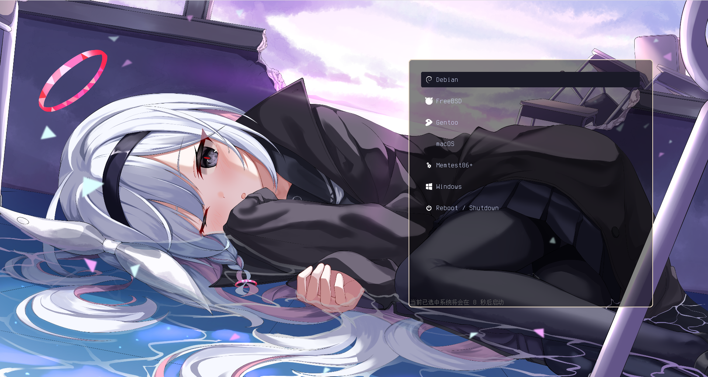
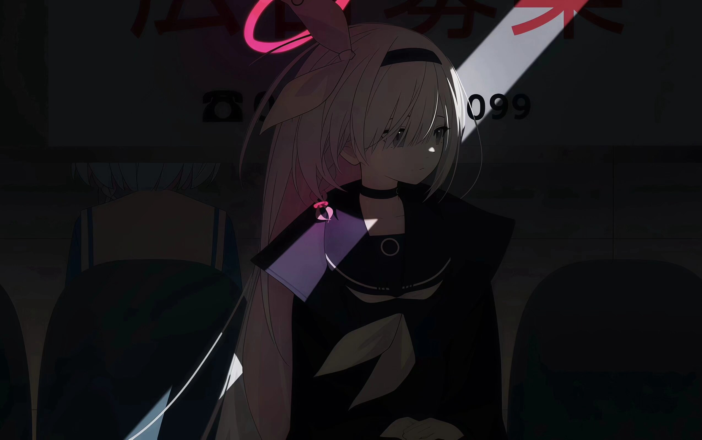
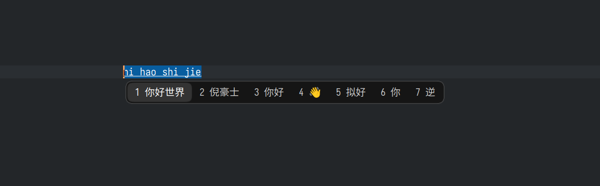
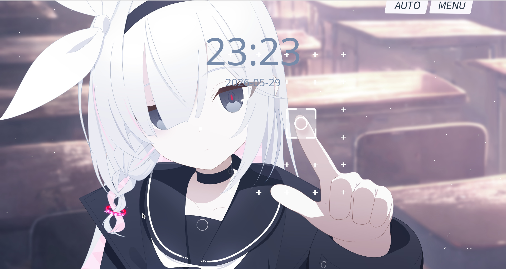

### plana-themes
这是一套普拉那的主题

包含如下内容:
- grub主题
- plymouth主题
- sddm主题
- 头像
- 壁纸
- fcitx5主题

- hyprlock锁屏主题

### 预览与安装
#### grub

```
cd plana-themes
sudo cp -r grub/plana /boot/grub/themes/

# 然后在 /etc/default/grub 添加 
# GRUB_THEME="/boot/grub/themes/plana/theme.txt"

sudo grub-mkconfig -o /boot/grub/grub.cfg
```

#### plymouth
启动:

https://github.com/user-attachments/assets/dcb8c46d-7960-4c63-8dcb-68cfaccecabd

关机:

https://github.com/user-attachments/assets/9e33e495-98a6-4f3e-89ba-14a45a0633b2

```
# 确保已安装并正确设置了 plymouth
cd plana-themes
sudo cp -r plymouth/plana /usr/share/plymouth/themes/
sudo plymouth-set-default-theme -R plana
```
> ⚠️注意: 该plymouth主题由于体积庞大,所以开机时,可能会造成启动时间比原来多5秒左右的问题

#### sddm

https://github.com/user-attachments/assets/a0f00ec9-e2a5-4a51-9491-6de530171b4d

```
cd plana-themes
sudo pacman -S sddm qt6-svg qt6-virtualkeyboard qt6-multimedia-ffmpeg
7z x sddm/plana/Backgrounds/plana.7z.001 -osddm/plana/Backgrounds/
sudo cp sddm/plana/Fonts/NotoSansMono-VariableFont_wdth,wght.ttf /usr/share/fonts/
sudo cp -r sddm/plana /usr/share/sddm/themes

echo "[Theme]
Current=plana" | sudo tee /etc/sddm.conf

echo "[General]
InputMethod=qtvirtualkeyboard" | sudo tee /etc/sddm.conf.d/virtualkbd.conf
```

#### 头像


#### 壁纸


#### fcitx5

```
cp -r fcitx5/OriDark $HOME/.local/share/fcitx5/themes/
# 打开配置工具,选择该主题
```

#### hyprlock

```
cp hyprlock/* ~/.config/hypr/
```

### 特别鸣谢
- grub:
  - 样式框: [Astronaut](https://github.com/Flava-Clown/AstronautGrub)
  - 启动项图标: [Honkai: Star Rail Grub Themes](https://github.com/voidlhf/StarRailGrubThemes)
- plymouth:
  - 动画来源: [【블루 아카이브】 최종장 - 그리고 모든 기적이 시작되는 곳 모션그래픽(애니메이션) 총집본](https://youtube.com/watch?v=ojFtSdz5Ork) 与 [【블루 아카이브】 최종장 '그리고 모든 기적이 시작되는 곳' 테마 애니메이션(모션그래픽)](https://youtu.be/Z6fFPcx_u7c)
  - 输入框与提示: [plymouth-themes](https://github.com/adi1090x/plymouth-themes)
- sddm:
  - 修改自 [sddm-astronaut-theme](https://github.com/Keyitdev/sddm-astronaut-theme)
  - 动态壁纸: [plana-普拉娜-4k](https://steamcommunity.com/sharedfiles/filedetails/?id=3347348809)
- fcitx5: 来自 [Ori-Fcitx5](https://github.com/Reverier-Xu/Ori-Fcitx5)
- 另外: 一些图像资源的创作者暂未知, 如果你知道,请提出一个 issue ,贴出原始出处, 我将会将原始出处贴在这里 :D
